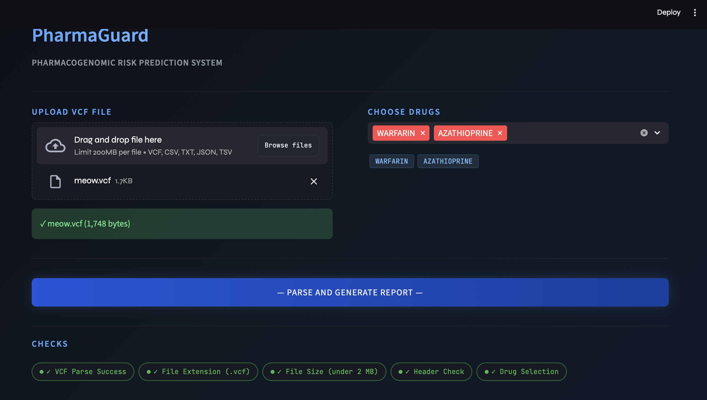
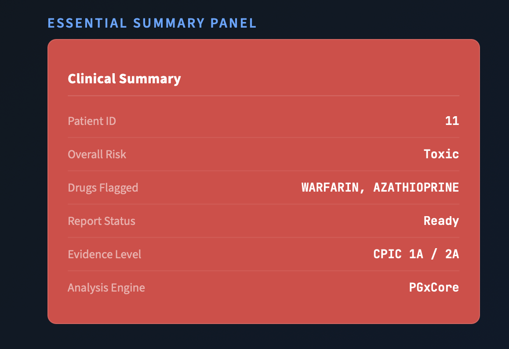

# PharmaGuard
## PHARMACOGENOMIC RISK PREDICTION SYSTEM

Deployment Link: https://pharmaguardrift.streamlit.app

## 🧠 Problem Overview

Adverse drug reactions contribute to large numbers of preventable hospitalizations and deaths. Many reactions are avoidable through **pharmacogenomics (PGx)**: analyzing how genetic variants influence drug metabolism and response.

PharmaGuard helps generate a structured PGx report by:
1. Accepting **VCF file uploads** (industry standard genomic variant format)
2. Detecting variants in 6 critical genes:
   - `CYP2D6, CYP2C19, CYP2C9, SLCO1B1, TPMT, DPYD`
3. Producing drug-specific risk labels:
   - `Safe | Adjust Dosage | Toxic | Ineffective | Unknown`
4. Returning **strict structured JSON** (exact schema)
5. Generating an explanation with citations (variant → mechanism → recommendation)

---

## ✨ Key Features

- **VCF upload interface** (drag-and-drop + file picker)
- **VCF validation** (file extension, size ≤ 5MB)
- **Drug input** (single or multiple, comma-separated)
- **Risk classification** per drug
- **Structured JSON output** (schema-compliant)
- **Color-coded result UI** (Green/Yellow/Red)
- **Expandable details** (variants, recommendation, explanation, quality metrics)
- **Copy JSON** + **Download JSON**
- Friendly error handling
---

## 🏗️ Tech Stack

**Frontend (Python Streamlit)**
- Uploads `.vcf`
- Sends `multipart/form-data` request to backend
- Displays results + downloads JSON

**Backend (Python)**
- Receives VCF file + drug list
- Parses VCF (teammate module)
- Computes diplotype/phenotype + drug-specific risk
- Returns JSON matching required schema

## 🎸 Implementation

### Home / Upload Screen

### Results Screen

### JSON Output Example

---

## Architecture

